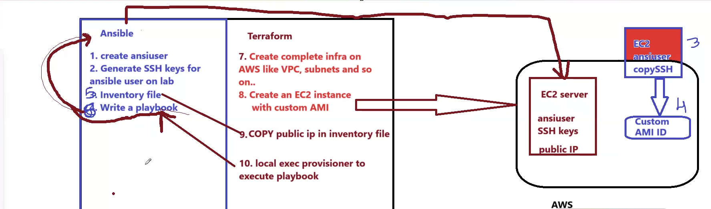
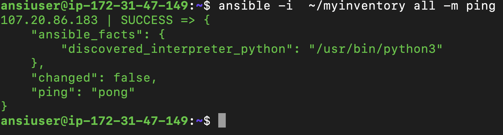
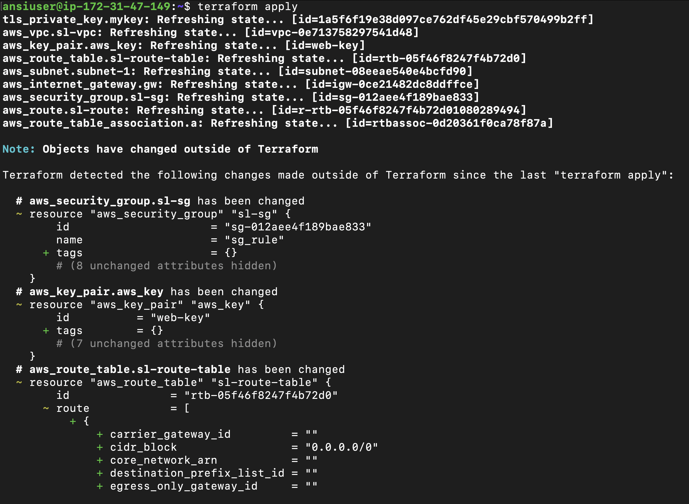
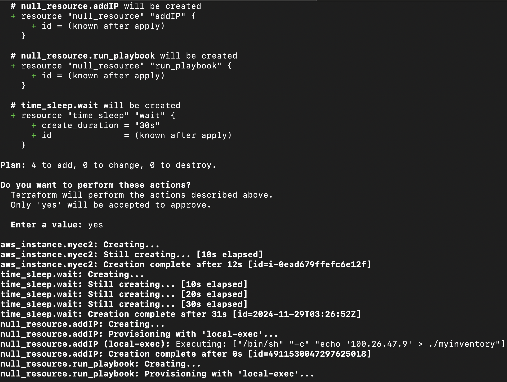
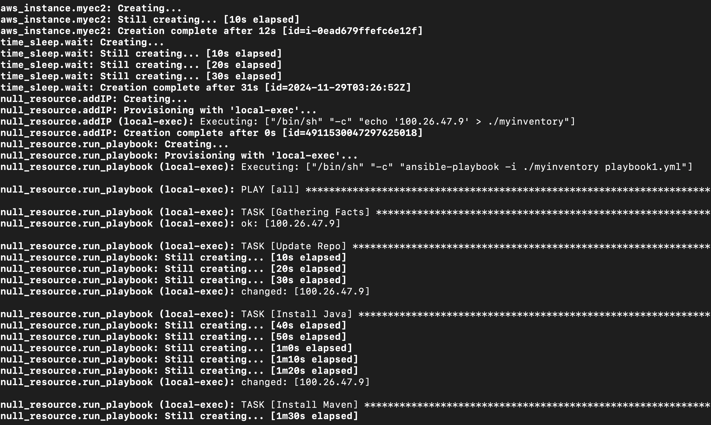
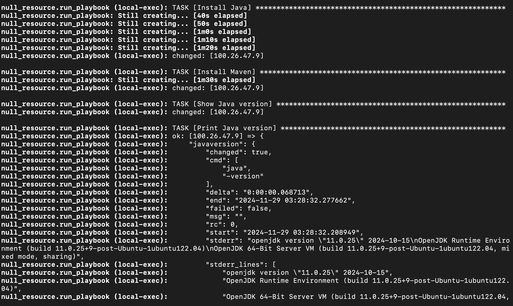
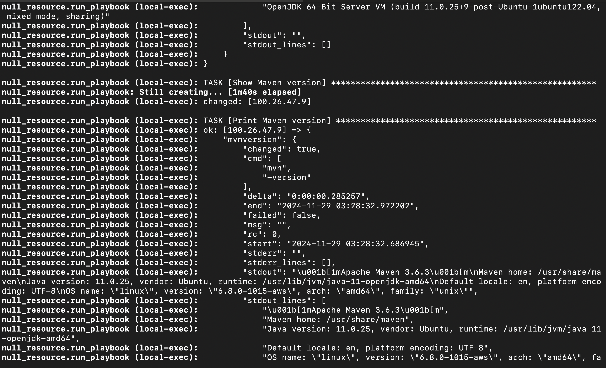
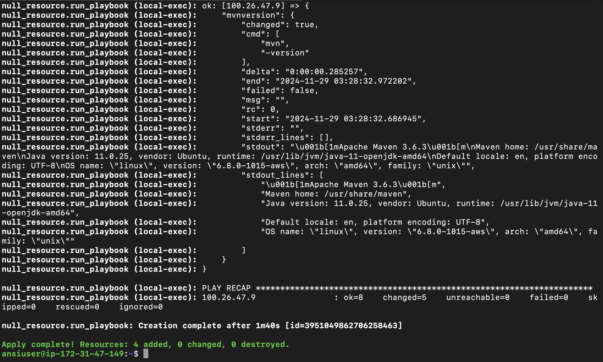
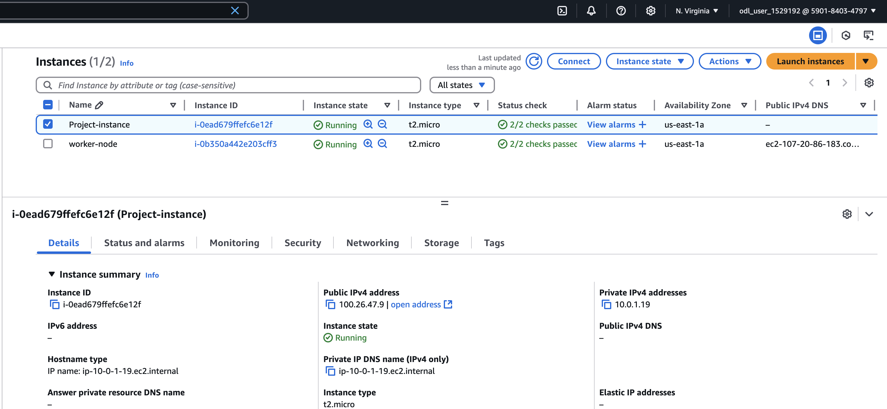
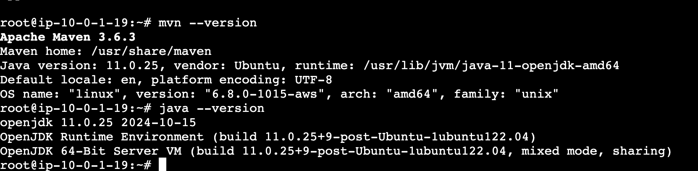

#Provisioning and Configuration Management Using Terraform and Ansible

Objective: To automate the deployment and configuration of infrastructure in AWS using Terraform for provisioning and Ansible for configuration management. The solution involves creating a sandbox environment with essential AWS resources, using Terraform to provision the infrastructure, and leveraging Ansible for post-deployment tasks.

Requirements:

- Infrastructure as Code (IaC): Use Terraform to create and manage AWS infrastructure components, such as VPC, subnets, route tables, security groups, and EC2 instances.
- Configuration Management: Use Ansible to perform post-deployment configuration tasks on the provisioned instances.
- Automated Key Management: Generate and manage SSH key pairs dynamically using Terraform to ensure secure communication between master and worker nodes.
- Parameterization: Utilize variables in Terraform to enable reusable and flexible configurations.
- Integration of Tools: Seamlessly integrate Terraform and Ansible to ensure smooth provisioning and configuration processes.
- Remote AWS Access: Use the AWS CLI to set up access credentials for automated remote infrastructure management.

Solution
Configure Terraform with new ssh key which will be used as key pair for launching VMs 
- We Open DevOps Lab which will be the master node( where Ansible and Terraform operates)
- Switch to Root user using command : sudo su -
- We create a new user called ansiuser and make it a sudo user by adding it in file /etc/sudoers
- Switch to ansiuser using the command : su - ansiuser
- Generate SSH key for ansiuser: ssh-keygen
- We create a worker node in AWS (ES2 instance) then we access it via ssh

- Switch to Root user using command sudo su -
- We create a new user called ansiuser and make it a sudo user by adding it in file /etc/sudoers
- Switch to ansiuser using the command : su - ansiuser
- Go to master node and copy the ssh public key of ansiuser : # cat /home/ansiuser/.ssh/id_rsa.pub
- Right click and copy the key
- Go to Worker node (AWS VM): # echo "<give your public key>" >> ~/.ssh/authorized_keys
- We can create an inventory file and playbook and check if SSH connection is working or not
- We copy the public IP of the worker node in myinvenory file the we execute a command: # ansible -i  ~/myinventory all -m ping
  
- We create an AMI from the worker node EC2 instance

- Configure AWS CLI with access key and secret key to establish connection remotely  
  apt-get update
  apt-get install awscli -y
  aws configure
- Give the valid access key and secret key
- Press enter, no need to give any region and format option

- To verify if the credentials have been set for aws: # cat ~/.aws/credentials
  
After the project configuration of users and ssh keys: 
- We create a file playbook1.yml in the same directory of inventory file
- We execute this playbook with command: # ansible-playbook -i ~/myinventory playbook1.yml
- we create a file aws_infra.tf
- Then write a command : #terraform init
- Then write a command : #terraform apply
  
  
  
  
  
  
  This the the project-instance EC2 node created on AWS
  
  Theses are packages installed on the instance project EC2: Java and Maven
   

